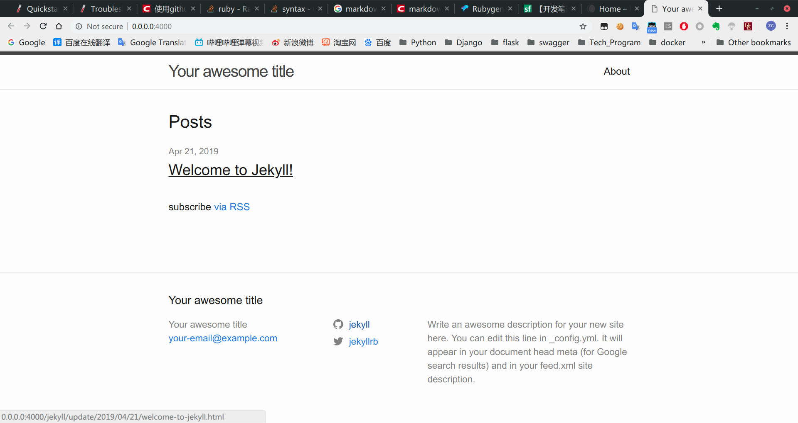
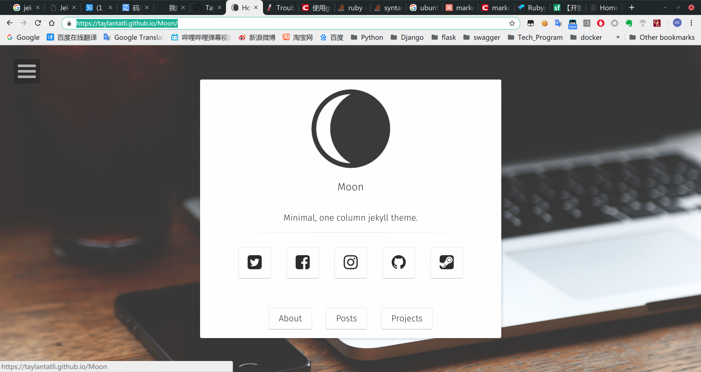

# Github博客搭建指南（JEKYLL框架）

这篇文章将介绍如何用JEKYLL框架搭建github博客。国内关于jekyll的文章比较少，大多数都是基于hexo搭建博客的。然而github官方推荐jekyll，所以我就用它了。折腾几天，终于学会了，这里面坑有点多，页面美化也有点麻烦。下面详细的介绍下搭建的步骤和过程。

自从github Page功能推出以来， 很多人都在github上搭建博客。确实，github Page的优点非常多，比如无限流量、免费服务器、一键上传部署等等。
github Pages可以被认为是用户编写的、托管在github上的静态网页，我们可以把团队、项目、个人网页上传到github，别人访问非常方便。

前提条件
1. 有github账号
2. 会 Git 和 Linux
3. 会 docker (JEKYLL依赖项有点多，所以推荐用docker)

> github Page 介绍 https://pages.github.com/  
> JEKYLL 介绍 https://jekyllrb.com/  
> jekyll镜像地址 https://github.com/envygeeks/jekyll-docker/blob/master/README.md

# 开始
注意，下面都是在Linux环境中操作的  
## 创建仓库
这一步参考 https://pages.github.com/  ，创建含有hello world的index.html。  
1. 在github上创建一个仓库，名称是“你的Github账号名.github.io”  
2. 编辑内容，仓库上传之后，网页也会随之更新，最后看到hello页面  

## 安装jekyll
现在的页面太简单了，没有帖子、没有图片，距离博客还差得远。我们要使用jekyll框架来生成静态网页，提供丰富多样的页面效果。

jekyll是一个基于ruby开发的，专用于构建静态网站的程序。它能够将一些动态的组件：模板、liquid代码等构建成静态的页面集合，Github-Page全面引入jekyll作为其构建引擎，这也是学习jekyll的主要动力。同时，除了jekyll引擎本身，它还提供一整套功能，比如web server。我们用jekyll –server启动本地调试就是此项功能。读者可能已经发现，在启动server后，之前我们的项目目录下会多出一个_site目录。jekyll默认将转化的静态页面保存在_site目录下，并以某种方式组织。使用jekyll构建博客是十分适合的，因为其内建的对象就是专门为blog而生的，在后面的逐步介绍中读者会体会到这一点。但是需要强调的是，jekyll并不是博客软件，跟workpress之类的完全两码事，它仅仅是个一次性的模板解析引擎，它不能像动态服务端脚本那样处理请求。
> 摘录 https://www.ezlippi.com/blog/2015/03/github-pages-blog.html

因为安装jekyll比较麻烦，所以我用docker创建一个jekyll容器，但还需要在容器内部安装一些插件。  

进入博客仓库 `cd ~/jiangzc.github.io`  

创建jekyll容器
```bash 
# 进入了吗
$ pwd                  
/home/jzc/Programs/jiangzc.github.io

# 容器名为jekyll
# 当前目录映射到容器内部的/srv/jekyll
# 端口映射4000:400, 进入bash
docker run --name jekyll \
  --volume="$PWD:/srv/jekyll"  \
  -p 4000:4000	 \
  -it jekyll/builder:3.8  bash
```

替换gem源
gem install 速度非常慢，有时会卡，所以要用清华大学的镜像
> 参考 https://mirror.tuna.tsinghua.edu.cn/help/rubygems/

```bash
# In container
# 添加 TUNA 源并移除默认源
gem sources --add https://mirrors.tuna.tsinghua.edu.cn/rubygems/ --remove https://rubygems.org/
# 列出已有源
gem sources -l
# 应该只有 TUNA 一个

bash bundle config mirror.https://rubygems.org https://mirrors.tuna.tsinghua.edu.cn/rubygems
```

容器内部，安装可能用到的插件
```bash
bundle update # 很慢，估计等5分钟....
gem install redcarpet && gem install pygments.rb
```

接下来测试 jekyll  
按照[官网](https://jekyllrb.com/docs/)的QuickStart部分，从第三步`jekyll new myblog`开始做，查看页面效果
> 如果遇到依赖项错误，根据提示安装 Run `bundle install` to install missing gems.  
如果执行 `bundle exec jekyll serve` 有问题
就执行 `jekyll serve `

   

成功，接下来~~阅读官方文档，从头开始，闭门造车~~，当然是使用别人配置好的模板适当修改，我们就能做出自己的博客啦。    
在网上随便找了一些：
+ [有哪些简洁明快的 Jekyll 模板？](https://www.zhihu.com/question/20223939)
+ [Jekyll Themes](http://jekyllthemes.org/)
+ [BeautifulJekyllTheme](https://www.chairyfish.com/BeautifulJekyllTheme/)

## 下载模板
接下来以 [Moon主题](https://taylantatli.github.io/Moon/) 为例，说明配置方法  
> 项目地址 https://github.com/TaylanTatli/Moon   
> DEMO  https://taylantatli.github.io/Moon/

删除刚才测试的myblog文件夹，回到jiangzc.github.io目录   
下载Moon的zip压缩包，解压到你的博客文件夹,目录树像这样
```bash
# jzc @ Precision in ~ [14:06:15] 
$ tree -dL 1 jiangzc.github.io
jiangzc.github.io
├── about
├── assets
├── _data
├── _includes
├── _layouts
├── myblog
├── posts
├── _posts
├── projects
├── _sass
├── _site
└── tags
```
在容器里，输入`jekyll serve` 或 `bundle exec jekyll serve`， 可能要解决依赖项问题 `gem install ...`  
浏览器访问http://localhost:4000 ， 效果如下

后续配置参考 https://taylantatli.github.io/Moon/moon-theme/ ，完成后用`jekyll serve` 或 `bundle exec jekyll serve`重新生成页面，本地确认后push到github上就可以了。

## 相关资料
[利用github-pages建立个人博客](https://www.ezlippi.com/blog/2015/03/github-pages-blog.html)  非常好   
[博客搭建详细教程](https://github.com/qiubaiying/qiubaiying.github.io/wiki/%E5%8D%9A%E5%AE%A2%E6%90%AD%E5%BB%BA%E8%AF%A6%E7%BB%86%E6%95%99%E7%A8%8B)
 很详细，但没有使用jekyll框架，它是基于成品修改的，不够个性化  
[阮一峰的网络日志](http://www.ruanyifeng.com/blog/2012/08/blogging_with_jekyll.html) 推荐看一下